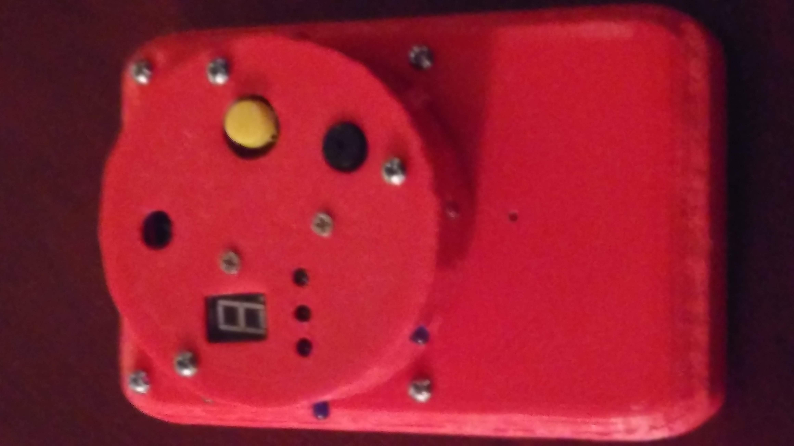

# Noah Howlett

- Email: howlett.4@wright.edu
- [Youtube](https://www.youtube.com/@BirdyEnforcement)
- Discord: NerdyEnforcement

## Skills
- Proficient usage of Microsoft Office 365 products,
- Exceptional usage of Linux, Windows, and UNIX.
- Database and Website design using MySQL, Bootstrap, HTML/CSS/JS/PHP, Docker.
- Programing with: Git, Bash, Java, C#, C/C++, Python.
- Game design utilizing Unity.
- Arduino and a proficient understand of circuitry. (Soldiering, wiring diagrams, hands on experience)
- 2+ Years of experience using SolidWorks.
- Phenomenal public speaking and presentation skills.

## Projects

### Unity Game
FPS/TPS game which shows off my skills not only as a game designer, but as a computer programmer as well.
This github repo, [The Adventure's of Sabrina and Shell](https://github.com/nerdynoah/The-Adventures-of-Sabrina-and-Shell), contains all of the code for the project.

### Arduino Projects

Bird Feeder

  Example of Bird Feeder in action:
  [Youtube Video](https://www.youtube.com/watch?v=NNDi2FEeyZc)

Science Fair Project: (A timer which is set via a IR remote, and counts down over time using the 8 LED's on the edges)

