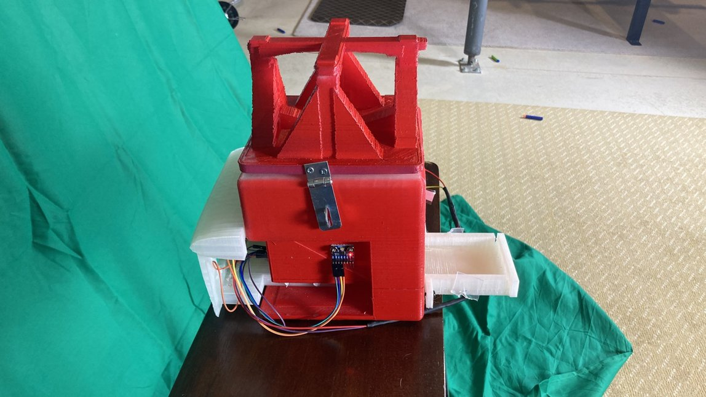

# Noah Howlett

- Email: howlett.4@wright.edu
- [Youtube](https://www.youtube.com/@BirdyEnforcement)
- Discord: NerdyEnforcement

## Projects

### Unity Game
FPS/TPS game with tooling, weapons, items, inventory, enemies, etc...
[The Adventure's of Sabrina and Shell](https://github.com/nerdynoah/The-Adventures-of-Sabrina-and-Shell)

### Arduino Projects

Bird Feeder

  Example of Bird Feeder in action:
  [Youtube Video](https://www.youtube.com/watch?v=NNDi2FEeyZc)

Science Fair Project:

## Skills
- Proficient usage of Microsoft Office 365 products,
- Exceptional usage of Linux, Windows, and UNIX.
- Database and Website design using MySQL, Bootstrap, HTML/CSS/JS/PHP, Docker.
- Programing with: Git, Bash, Java, C#, C/C++, Python.
- Game design utilizing Unity.
- Arduino and a proficient understand of circuitry. (Soldiering, wiring diagrams, hands on experience)
- 2+ Years of experience using SolidWorks.
- Phenomenal public speaking and presentation skills. ([presentation example](https://www.youtube.com/watch?v=Lw075KR24iE&list=PLBWCE0NqaWBrNbnPSjD8sF1TPFKfpuZ1i&index=5)
